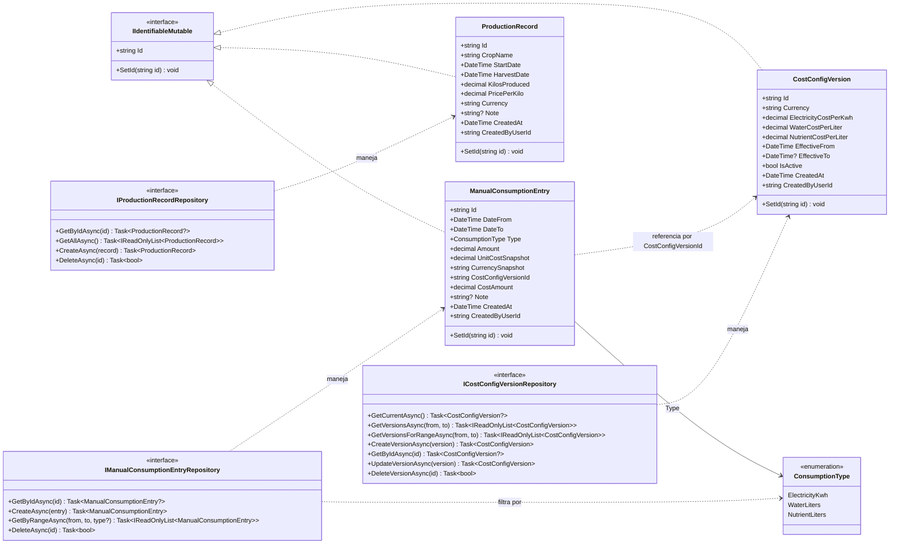
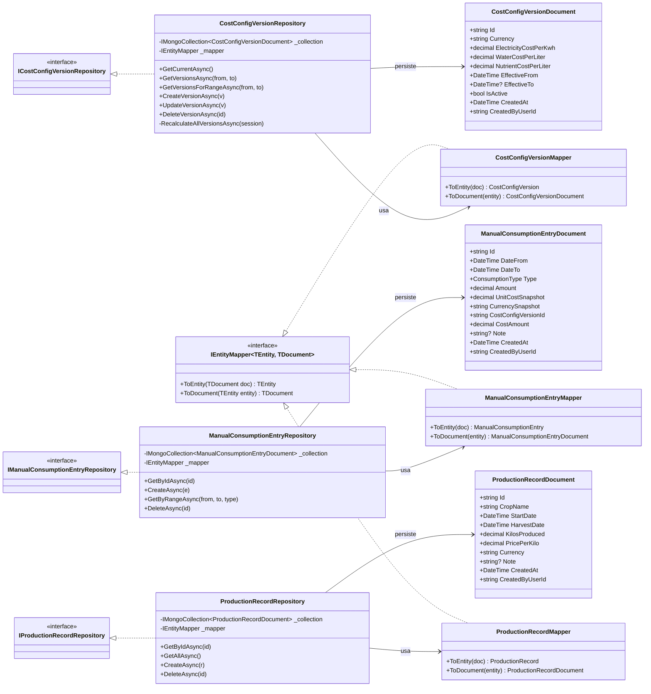

# Diagrama de Clases — BI Service

Diagramas de clases del microservicio `bi-service` (Business Intelligence) ubicado en
[software-project/bi-service/](../software-project/bi-service/).

El servicio sigue **Clean Architecture** con cuatro capas: Domain, Application, Infrastructure y Api.
Para mantener la legibilidad, el modelo se descompone en tres vistas, una por capa.

---

## 1. Capa de Dominio

Entidades, enumeraciones e interfaces de repositorio. Esta capa no depende de ninguna otra.

---

## 2. Capa de Infraestructura — Persistencia MongoDB

Documentos Mongo, mappers e implementaciones concretas de los repositorios del dominio.

---

## 3. Capa de Aplicación + Api — CQRS con MediatR

Controladores HTTP, handlers de Commands/Queries y pipeline de validación.

```mermaid
classDiagram
    direction TB

    class ISender {
        <<interface>>
        +Send(request) Task~TResponse~
    }

    class CostConfigController {
        -ISender _sender
        +GetCurrent()
        +GetVersions(from, to)
        +CreateVersion(req)
        +UpdateVersion(id, req)
        +DeleteVersion(id)
    }

    class ConsumptionEntriesController {
        -ISender _sender
        +Create(req)
        +GetByRange(from, to, type)
        +GetSummary(from, to)
        +Delete(id)
    }

    class ProductionRecordsController {
        -ISender _sender
        +Create(req)
        +GetAll()
        +GetById(id)
        +Delete(id)
    }

    class OperationalCostController {
        -ISender _sender
        +Calculate(req)
    }

    class ProfitabilityController {
        -ISender _sender
        +Calculate(req)
    }

    class CreateCostConfigVersionCommandHandler {
        -ICostConfigVersionRepository _repo
    }
    class UpdateCostConfigVersionCommandHandler {
        -ICostConfigVersionRepository _repo
    }
    class DeleteCostConfigVersionCommandHandler {
        -ICostConfigVersionRepository _repo
    }
    class GetCurrentCostConfigQueryHandler {
        -ICostConfigVersionRepository _repo
    }
    class GetCostConfigVersionsQueryHandler {
        -ICostConfigVersionRepository _repo
    }

    class CreateConsumptionEntryCommandHandler {
        -IManualConsumptionEntryRepository _entries
        -ICostConfigVersionRepository _config
    }
    class DeleteConsumptionEntryCommandHandler {
        -IManualConsumptionEntryRepository _entries
    }
    class GetConsumptionEntriesQueryHandler {
        -IManualConsumptionEntryRepository _entries
    }
    class GetConsumptionSummaryQueryHandler {
        -IManualConsumptionEntryRepository _entries
    }

    class CreateProductionRecordCommandHandler {
        -IProductionRecordRepository _repo
    }
    class DeleteProductionRecordCommandHandler {
        -IProductionRecordRepository _repo
    }
    class GetProductionRecordByIdQueryHandler {
        -IProductionRecordRepository _repo
    }
    class GetProductionRecordsQueryHandler {
        -IProductionRecordRepository _repo
    }

    class CalculateOperationalCostQueryHandler {
        -ICostConfigVersionRepository _config
        +Handle(request) OperationalCostResponse
        -BuildPeriods(versions, from, to) List
    }

    class CalculateProfitabilityQueryHandler {
        -IProductionRecordRepository _production
        -IManualConsumptionEntryRepository _consumption
        -ISender _sender
        +Handle(request) ProfitabilityResponse
    }

    class ValidationBehavior~TRequest, TResponse~ {
        <<MediatR pipeline>>
        -IEnumerable~IValidator~ _validators
    }

    class ICostConfigVersionRepository {
        <<interface>>
    }
    class IManualConsumptionEntryRepository {
        <<interface>>
    }
    class IProductionRecordRepository {
        <<interface>>
    }

    CostConfigController --> ISender
    ConsumptionEntriesController --> ISender
    ProductionRecordsController --> ISender
    OperationalCostController --> ISender
    ProfitabilityController --> ISender

    ISender ..> CreateCostConfigVersionCommandHandler : despacha
    ISender ..> UpdateCostConfigVersionCommandHandler : despacha
    ISender ..> DeleteCostConfigVersionCommandHandler : despacha
    ISender ..> GetCurrentCostConfigQueryHandler : despacha
    ISender ..> GetCostConfigVersionsQueryHandler : despacha
    ISender ..> CreateConsumptionEntryCommandHandler : despacha
    ISender ..> DeleteConsumptionEntryCommandHandler : despacha
    ISender ..> GetConsumptionEntriesQueryHandler : despacha
    ISender ..> GetConsumptionSummaryQueryHandler : despacha
    ISender ..> CreateProductionRecordCommandHandler : despacha
    ISender ..> DeleteProductionRecordCommandHandler : despacha
    ISender ..> GetProductionRecordByIdQueryHandler : despacha
    ISender ..> GetProductionRecordsQueryHandler : despacha
    ISender ..> CalculateOperationalCostQueryHandler : despacha
    ISender ..> CalculateProfitabilityQueryHandler : despacha

    ValidationBehavior ..> ISender : pipeline

    CreateCostConfigVersionCommandHandler --> ICostConfigVersionRepository
    UpdateCostConfigVersionCommandHandler --> ICostConfigVersionRepository
    DeleteCostConfigVersionCommandHandler --> ICostConfigVersionRepository
    GetCurrentCostConfigQueryHandler --> ICostConfigVersionRepository
    GetCostConfigVersionsQueryHandler --> ICostConfigVersionRepository

    CreateConsumptionEntryCommandHandler --> IManualConsumptionEntryRepository
    CreateConsumptionEntryCommandHandler --> ICostConfigVersionRepository
    DeleteConsumptionEntryCommandHandler --> IManualConsumptionEntryRepository
    GetConsumptionEntriesQueryHandler --> IManualConsumptionEntryRepository
    GetConsumptionSummaryQueryHandler --> IManualConsumptionEntryRepository

    CreateProductionRecordCommandHandler --> IProductionRecordRepository
    DeleteProductionRecordCommandHandler --> IProductionRecordRepository
    GetProductionRecordByIdQueryHandler --> IProductionRecordRepository
    GetProductionRecordsQueryHandler --> IProductionRecordRepository

    CalculateOperationalCostQueryHandler --> ICostConfigVersionRepository
    CalculateProfitabilityQueryHandler --> IProductionRecordRepository
    CalculateProfitabilityQueryHandler --> IManualConsumptionEntryRepository
    CalculateProfitabilityQueryHandler ..> CalculateOperationalCostQueryHandler : reutiliza vía ISender
```

---

## Notas de diseño

- **Clean Architecture**: las dependencias siempre apuntan hacia adentro. Infraestructura implementa interfaces del Dominio; la Aplicación coordina el flujo sin conocer detalles de persistencia.
- **CQRS con MediatR**: los controladores no inyectan repos, sólo `ISender`. Cada operación de negocio se modela como `Command` o `Query` con su `Handler`, y un `ValidationBehavior` actúa como pipeline previo.
- **Patrón Document + Mapper**: `IEntityMapper<TEntity, TDocument>` desacopla las entidades de dominio de los modelos persistentes con atributos `[Bson*]`.
- **Snapshot histórico de costos**: `ManualConsumptionEntry` guarda `UnitCostSnapshot`/`CurrencySnapshot` además de la referencia al `CostConfigVersionId`, garantizando trazabilidad aunque la versión de costos cambie después.
- **Composición entre handlers**: `CalculateProfitabilityQueryHandler` reutiliza `CalculateOperationalCostQueryHandler` vía `ISender` en lugar de duplicar la lógica de cálculo.
- **Versionado de configuración con transacciones**: `CostConfigVersionRepository.CreateVersionAsync`/`UpdateVersionAsync`/`DeleteVersionAsync` ejecutan dentro de una sesión Mongo y recalculan `EffectiveTo`/`IsActive` de todas las versiones para mantener la consistencia temporal.
