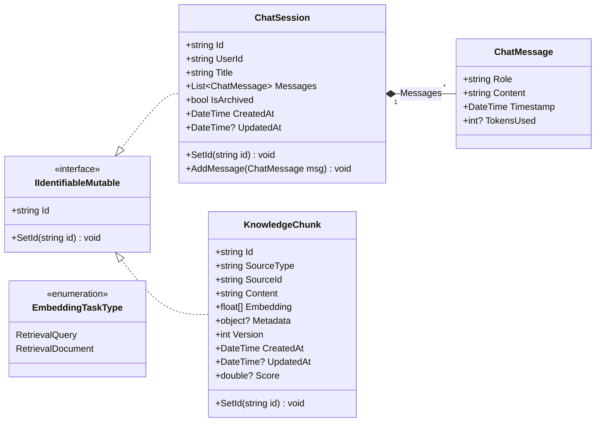
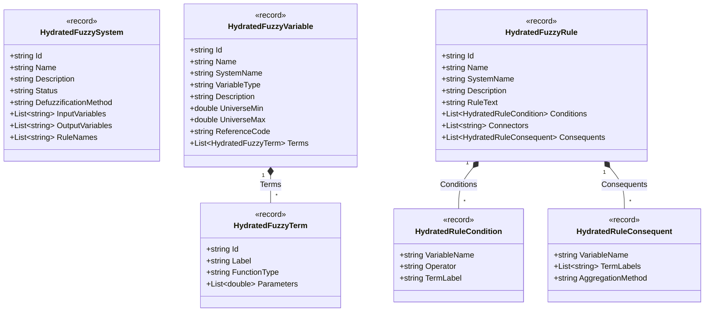
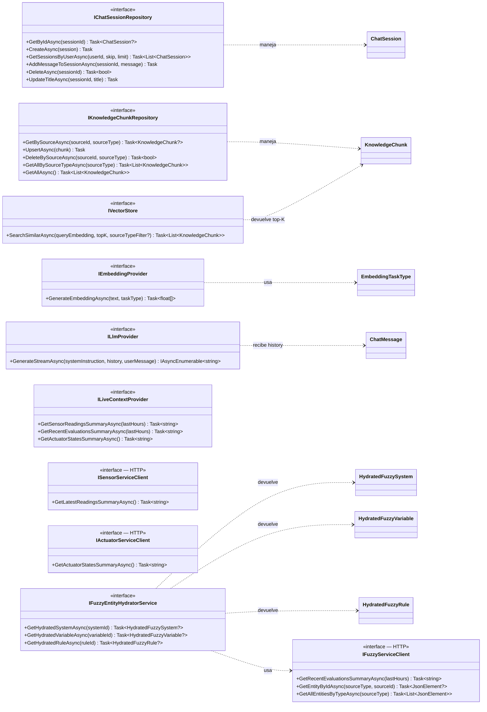

# Diagrama de Clases — Chatbot Service (Capa de Dominio)

Capa de dominio del microservicio `chatbot-service` ubicado en
[software-project/chatbot-service/ChatbotService.Domain/](../software-project/chatbot-service/ChatbotService.Domain/).

Responsabilidad: orquestar conversaciones con el LLM (Gemini) usando RAG sobre
MongoDB Atlas Vector Search, con contexto en tiempo real obtenido vía clientes
HTTP a `fuzzy-service`, `sensor-service` y `actuator-service`.

---

## 1. Entidades y Modelos de Dominio

---

## 2. Modelos de Hidratación Fuzzy (RAG)

Records inmutables que representan entidades del `fuzzy-service` ya hidratadas
(con sus relaciones resueltas) listas para inyectarse en el prompt del LLM.

---

## 3. Interfaces de Repositorio, Proveedores y Clientes Externos

---

## Notas de diseño

- **RAG sobre MongoDB Atlas Vector Search**: `KnowledgeChunk` almacena `Embedding: float[]` (768 dims, generado por `gemini-embedding-001`) y se indexa en Atlas. `IVectorStore.SearchSimilarAsync` usa `$vectorSearch` para recuperar los top-K más similares al embedding del query.
- **Identificador compuesto de chunks**: la pareja `(SourceType, SourceId)` es la clave funcional — `SourceType ∈ {fuzzy_rule, fuzzy_system, system_manual}`. `Version` se incrementa en cada re-vectorización para detectar cambios.
- **Streaming de respuestas LLM**: `ILlmProvider.GenerateStreamAsync` retorna `IAsyncEnumerable<string>` para tokens incrementales — habilita SSE/streaming hacia el cliente.
- **Contexto vivo separado del RAG**: `ILiveContextProvider` consulta KPIs en tiempo real (sensores, evaluaciones, actuadores) sin gastar embeddings. Internamente delega en los clientes HTTP de cada microservicio.
- **Frontera de microservicios respetada**: `IFuzzyServiceClient`, `ISensorServiceClient`, `IActuatorServiceClient` son puertos HTTP — el chatbot **no** consulta directamente las colecciones Mongo de otros bounded contexts.
- **Hidratación de entidades fuzzy**: `IFuzzyEntityHydratorService` resuelve referencias entre sistemas/variables/términos/reglas y produce records (`HydratedFuzzy*`) listos para inyectar en el prompt sin que el LLM tenga que navegar relaciones.
- **Sesión como aggregate root**: `ChatSession` agrega `ChatMessage` directamente; `AddMessage()` actualiza `UpdatedAt` para mantener el orden cronológico al listar sesiones del usuario.
