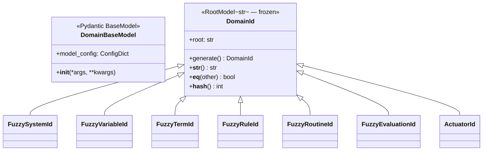
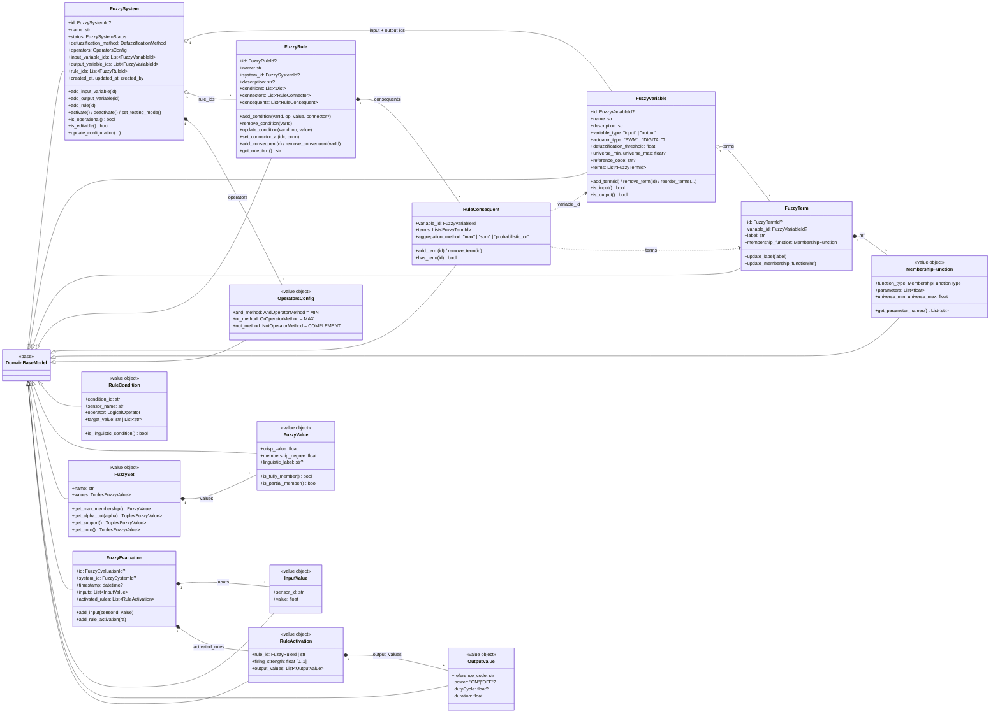
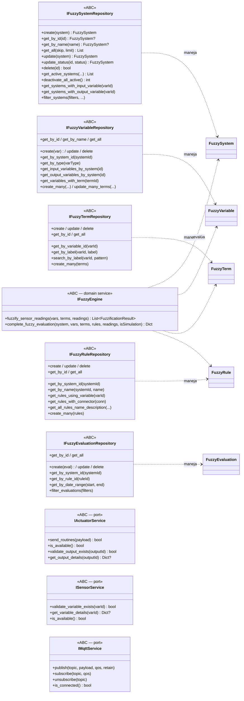

# Diagrama de Clases — Fuzzy Service (Capa de Dominio)

Capa de dominio del microservicio `fuzzy-service` (Python / FastAPI / Pydantic v2)
ubicado en
[software-project/fuzzy-service/FuzzyService/Domain/](../software-project/fuzzy-service/FuzzyService/Domain/).

Responsabilidad: modelar sistemas fuzzy Mamdani completos (variables, términos,
reglas con consecuentes multi-término), ejecutar inferencia y persistir
evaluaciones para auditoría, comunicándose con `actuator-service`,
`sensor-service` y MQTT mediante puertos.

Por la cantidad de tipos, el dominio se descompone en cuatro vistas.

---

## 1. Value Objects de Identidad

Jerarquía de IDs basada en `RootModel[str]` que admite tanto `ObjectId` (BSON)
como `UUID`, y normaliza el formato Mongo `{"$oid": "..."}`.

---

## 2. Enumeraciones del Dominio

```mermaid
classDiagram
    direction LR

    class FuzzySystemStatus {
        <<enumeration>>
        DRAFT
        ACTIVE
        INACTIVE
        TESTING
        +get_operational_statuses()
        +get_editable_statuses()
    }

    class FuzzyVariableType {
        <<enumeration>>
        INPUT = "input"
        OUTPUT = "output"
    }

    class EvaluationStatus {
        <<enumeration>>
        PENDING
        PROCESSING
        COMPLETED
        FAILED
        CANCELLED
    }

    class MembershipFunctionType {
        <<enumeration>>
        TRIANGULAR
        TRAPEZOIDAL
        GAUSSIAN
        SIGMOID
        BELL
        PI_SHAPED
        S_SHAPED
        Z_SHAPED
        LINEAR
        CONSTANT
    }

    class DefuzzificationMethod {
        <<enumeration>>
        CENTROID
        BISECTOR
        MOM
        SOM
        LOM
        WEIGHTED_AVERAGE
    }

    class AggregationMethod {
        <<enumeration>>
        MAX
        SUM
        PROBOR
    }

    class LogicalOperator {
        <<enumeration>>
        IS
        IS_NOT
        NOT
        GREATER_THAN
        LESS_THAN
        GREATER_EQUAL
        LESS_EQUAL
        BETWEEN
        IN
        NOT_IN
    }

    class RuleConnector {
        <<enumeration>>
        AND
        OR
    }

    class AndOperatorMethod {
        <<enumeration>>
        MIN
        PROD
    }

    class OrOperatorMethod {
        <<enumeration>>
        MAX
        SUM
        PROBOR
    }

    class NotOperatorMethod {
        <<enumeration>>
        COMPLEMENT
    }

    class PowerRange {
        <<enumeration>>
        PERCENT_0_100
        +min: float
        +max: float
    }

    class DurationRange {
        <<enumeration>>
        SECONDS_5_60
        +min: float
        +max: float
    }
```

---

## 3. Entidades, Value Objects de Configuración y Evaluación

---

## 4. Interfaces de Repositorio y Puertos Externos

---

## Notas de diseño

- **Pydantic v2 como base de dominio**: `DomainBaseModel` configura `validate_assignment=True`, `extra="forbid"`, `populate_by_name=True` y soporte para argumentos posicionales — habilita validaciones invariantes en cada mutación sin acoplar al framework.
- **IDs polimórficos por subclase**: `DomainId` es un `RootModel[str]` frozen que valida tanto `ObjectId` BSON como UUID. Las subclases (`FuzzySystemId`, etc.) dan tipado fuerte al pasar IDs entre repos sin permitir mezclar.
- **Mamdani con consecuentes multi-término**: `RuleConsequent.terms: List[FuzzyTermId]` permite que una regla active varios términos por variable de salida; `aggregation_method` decide cómo combinarlos (`max`/`sum`/`probabilistic_or`). Habilita agregación multi-regla antes de defuzzificar.
- **Reglas separan condiciones y conectores**: `len(connectors) == max(0, len(conditions) - 1)` se valida en `_validate_and_finalize`. Sólo se permiten `IS` / `IS_NOT` (etiquetas lingüísticas) — los operadores numéricos están explícitamente bloqueados.
- **`reference_code` como puente entre microservicios**: variables de entrada mapean al `code` de un sensor (`sensor-service`); variables de salida mapean al `code` del actuator (`actuator-service`). Evita compartir IDs internos entre bounded contexts.
- **Estados con políticas explícitas**: `FuzzySystemStatus.get_operational_statuses()` y `get_editable_statuses()` definen reglas — el sistema valida activación contra `_validate_for_activation` (mín. 1 input, 1 output, 1 regla).
- **`OutputValue` con campos mutuamente exclusivos**: `power` (digital ON/OFF) o `dutyCycle` (PWM 0-100) — el `model_validator` lo verifica. `duration` se valida contra el rango de la enum `DurationRange`.
- **Puertos hexagonales**: `IFuzzyEngine` (servicio de dominio), `IActuatorService`, `ISensorService` e `IMqttService` son ABCs en el dominio que la infraestructura implementa — el dominio no conoce HTTP ni el broker MQTT.
- **Auditoría con `FuzzyEvaluation`**: cada inferencia se persiste con `inputs` (lecturas de sensores en ese momento) y `activated_rules` (con `firing_strength` y `output_values` resultantes) — útil para reentrenar reglas y para el contexto del chatbot.
