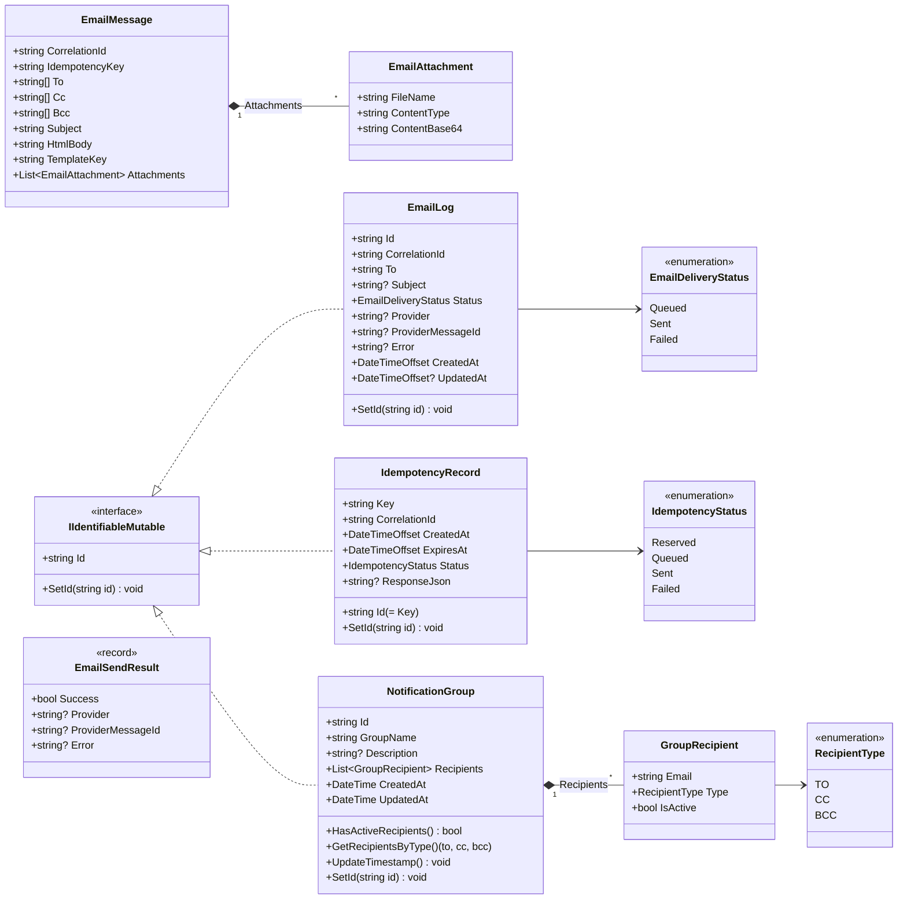
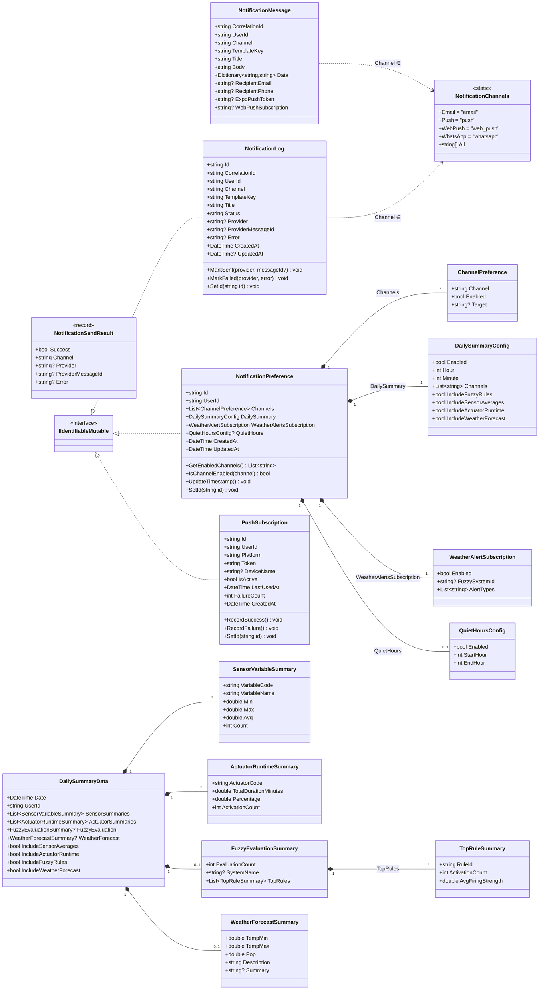
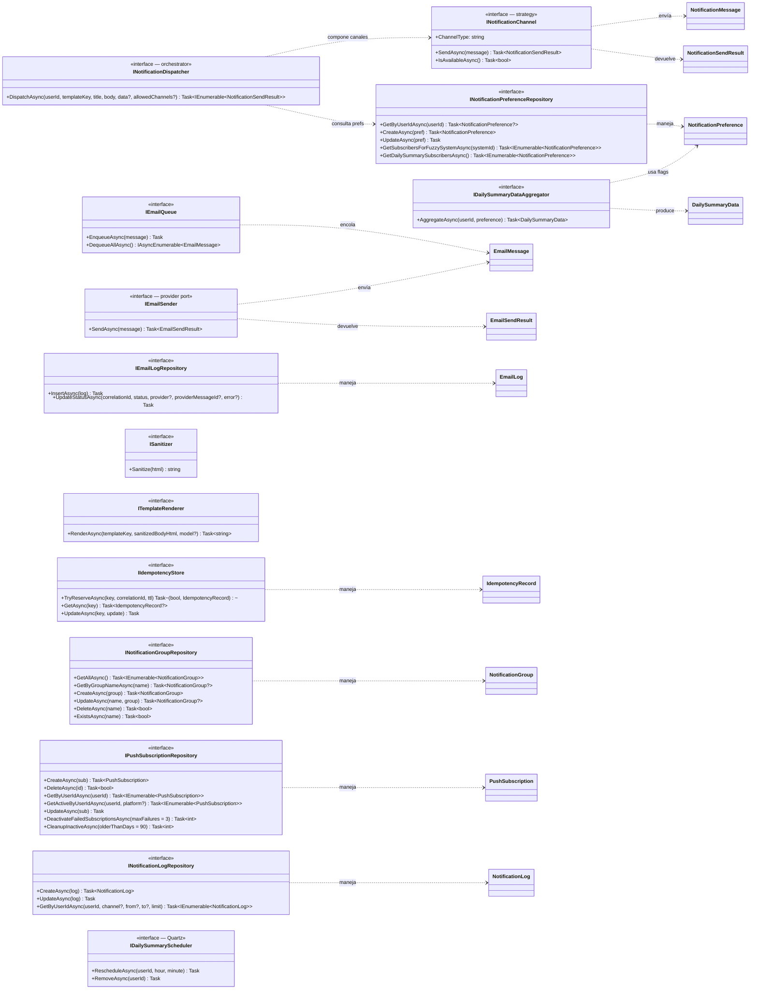

# Diagrama de Clases — Notification Service (Capa de Dominio)

Capa de dominio del microservicio `notification-service` ubicado en
[software-project/notification-service/NotificationService.Domain/](../software-project/notification-service/NotificationService.Domain/).

Responsabilidad: orquestar el envío de notificaciones multi-canal (email, push
Expo, WhatsApp, web push), gestionar preferencias por usuario, idempotencia,
plantillas, log unificado, y resúmenes diarios programados.

Por la cantidad de tipos, el dominio se descompone en tres vistas: pipeline de
email, pipeline multi-canal, y puertos/repositorios.

---

## 1. Pipeline de Email (legacy específico)

---

## 2. Pipeline Multi-Canal y Resumen Diario

---

## 3. Puertos, Repositorios y Servicios de Dominio

---

## Notas de diseño

- **Dos pipelines coexistentes**: el de **email puro** (`EmailMessage` → `IEmailQueue` → `IEmailSender` → `EmailLog`) sigue vivo para flujos que sólo necesitan correo; el **multi-canal** (`NotificationMessage` → `INotificationDispatcher` → `INotificationChannel` por estrategia → `NotificationLog`) lo complementa para alertas y resumen diario.
- **Patrón Strategy con `INotificationChannel`**: cada canal (email, push, web push, WhatsApp) implementa la misma interfaz, y `INotificationDispatcher` los compone según las preferencias del usuario y el filtro `allowedChannels`.
- **Idempotencia distribuida**: `IIdempotencyStore` usa Mongo con TTL — `TryReserveAsync` es atómico (`acquired` indica si fue el primer reservista) para evitar duplicados aún con reintentos del cliente o concurrencia entre nodos.
- **Política de salud de tokens push**: `PushSubscription.RecordFailure()` desactiva automáticamente el token al alcanzar 3 fallos consecutivos; `RecordSuccess()` resetea el contador. `DeactivateFailedSubscriptionsAsync` y `CleanupInactiveAsync` permiten mantenimiento batch.
- **Plantillas seguras**: `ISanitizer` (limpia HTML embebido) y `ITemplateRenderer` (renderiza el layout final) están desacoplados — la sanitización corre **antes** del renderizado para evitar XSS en cuerpos definidos por usuarios o servicios upstream.
- **Resumen diario por usuario**: `DailySummaryConfig` define hora local (UTC-5) y secciones a incluir; `IDailySummaryScheduler` programa un trigger Quartz por usuario y `IDailySummaryDataAggregator` consulta sólo las secciones habilitadas (sensores, actuadores, fuzzy, clima) — evita fan-out innecesario.
- **`QuietHoursConfig`**: ventana opcional para suprimir notificaciones no críticas (p.ej. 22:00 → 07:00). El dispatcher debe consultarla antes de enviar.
- **`NotificationLog` unificado vs `EmailLog` legacy**: el log nuevo cubre todos los canales con campos `Channel` y `Status` ("queued"/"sent"/"failed"/"delivered") y métodos `MarkSent`/`MarkFailed`. `EmailLog` se mantiene para auditoría histórica del pipeline antiguo.
- **Subscriber lookup por sistema fuzzy**: `GetSubscribersForFuzzySystemAsync` devuelve preferencias donde `WeatherAlertsSubscription.Enabled = true` y `FuzzySystemId` matchea o es `null` (auto-detect) — usado por `weather-service` vía cliente HTTP.
