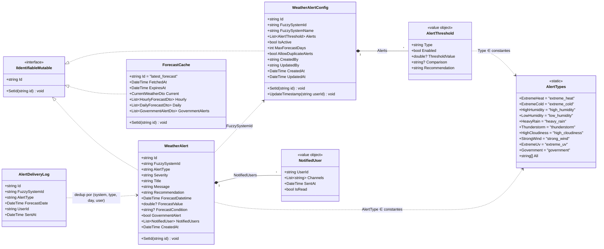
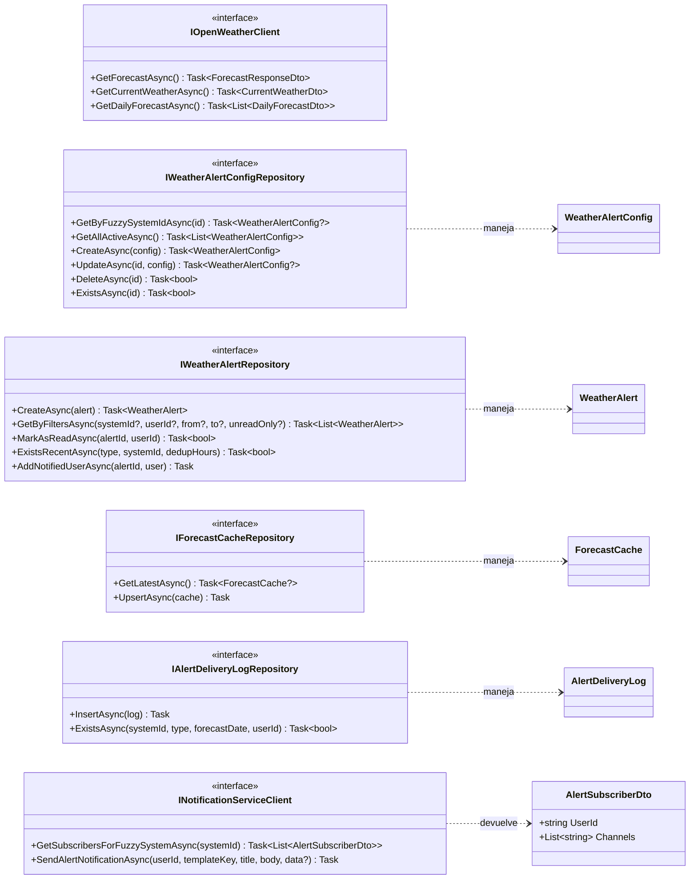

# Diagrama de Clases — Weather Service (Capa de Dominio)

Capa de dominio del microservicio `weather-service` ubicado en
[software-project/weather-service/WeatherService.Domain/](../software-project/weather-service/WeatherService.Domain/).

Responsabilidad: ingestar pronósticos (OpenWeather One Call 3.0) y alertas
gubernamentales (IDEAM), detectar superaciones de umbrales por sistema fuzzy
y delegar el envío en `notification-service`.

---

## 1. Entidades, Value Objects y Enumeraciones

---

## 2. Interfaces de Repositorio y Puertos Externos

---

## Notas de diseño

- **Configuración por sistema fuzzy**: cada `WeatherAlertConfig` está vinculado 1:1 con un `FuzzySystemId` (índice único). Permite tener distintos umbrales por invernadero/cultivo.
- **Deduplicación de envíos**: `AllowDuplicateAlerts = false` activa la verificación contra `AlertDeliveryLog` (Time Series Collection con `timeField = SentAt`, `metaField = FuzzySystemId`) — evita re-notificar el mismo usuario por el mismo (tipo, día de pronóstico).
- **Cache persistido**: `ForecastCache` usa el patrón singleton (ID fijo `"latest_forecast"`) para sobrevivir reinicios; complementa al `IMemoryCache` del cliente HTTP.
- **Snapshot de canales notificados**: `NotifiedUser` se persiste embebido en `WeatherAlert` con la lista de canales por los que se envió y un flag `IsRead` por usuario.
- **Acoplamiento con notification-service**: `INotificationServiceClient` es un puerto del dominio (no llama directo a Mongo) — respeta la frontera de microservicios.
- **Tipos de alerta como constantes**: `AlertTypes` es una clase estática con strings — facilita extensión sin recompilar enums y mantiene compatibilidad con MongoDB.
