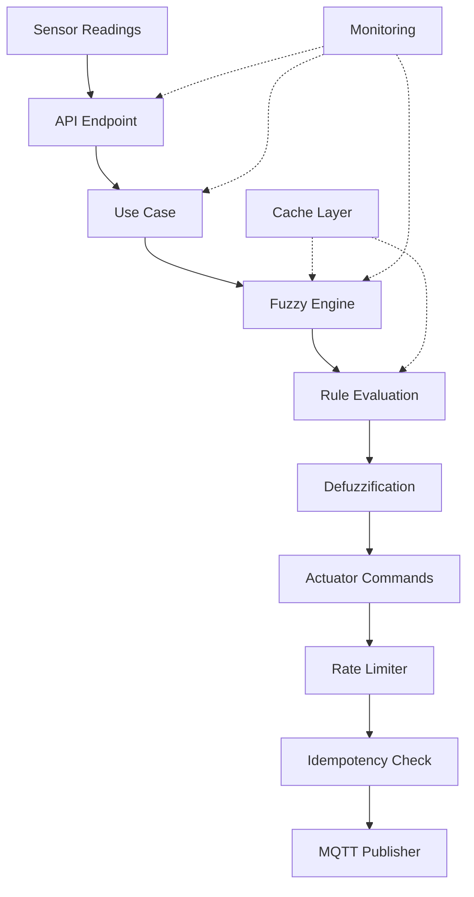

# Arquitectura del Servicio Fuzzy

## Visión General

El servicio fuzzy es un microservicio especializado en control difuso para sistemas hidropónicos. Implementa lógica difusa para evaluar lecturas de sensores y generar comandos de actuadores basados en reglas configurables.

## Arquitectura por Capas

### 1. Capa de API (`api/`)
- **Endpoints REST**: Interfaz HTTP para interactuar con el servicio
- **Autenticación JWT**: Validación de tokens y scopes
- **Validación de datos**: Usando Pydantic para DTOs
- **Monitoreo de endpoints**: Métricas de rendimiento integradas

### 2. Capa de Aplicación (`application/`)
- **Casos de uso**: Lógica de negocio encapsulada
- **Orquestación**: Coordinación entre servicios
- **Optimizaciones**: Caché, rate limiting, idempotencia

### 3. Capa de Dominio (`domain/`)
- **Modelos de negocio**: Entidades y value objects
- **Reglas de negocio**: Lógica específica del dominio
- **Interfaces**: Contratos para la infraestructura

### 4. Capa de Infraestructura (`infrastructure/`)
- **Motor fuzzy**: Implementación de lógica difusa optimizada
- **Base de datos**: Persistencia con MongoDB
- **Comunicación externa**: MQTT y HTTP clients
- **Optimizaciones**: Caché, monitoreo, procesamiento idempotente

## Componentes Principales

### Motor Fuzzy (`infrastructure/fuzzy_engine.py`)

**Optimizaciones implementadas:**
- ✅ **Caché de membresías**: Evita recálculos de funciones de membresía
- ✅ **Vectorización NumPy**: Operaciones matriciales para mejor rendimiento
- ✅ **Caché de evaluaciones**: Almacena resultados de evaluaciones completas
- ✅ **Monitoreo de rendimiento**: Métricas detalladas de operaciones

```python
# Ejemplo de optimización: caché de membresías
class FuzzyVariable:
    def __init__(self):
        self._membership_cache = InProcessCache(ttl_seconds=300, max_size=1000)
    
    def get_membership(self, value: float) -> float:
        cache_key = f"{self.name}_{value}_{hash(str(self.membership_function))}"
        cached_result = self._membership_cache.get(cache_key)
        if cached_result is not None:
            return cached_result
        # ... cálculo y almacenamiento en caché
```

### Sistema de Caché (`infrastructure/cache.py`)

**Características:**
- **TTL configurable**: Expiración automática de entradas
- **Límite de tamaño**: Prevención de uso excesivo de memoria
- **Estadísticas**: Métricas de hit/miss ratio
- **Thread-safe**: Seguro para uso concurrente

### Rate Limiting (`infrastructure/rate_limiter.py`)

**Funcionalidades:**
- **Límites por actuador**: Previene spam de comandos
- **Ventana deslizante**: Control preciso de frecuencia
- **Configuración flexible**: Límites ajustables por tipo

### Procesamiento Idempotente (`infrastructure/idempotency.py`)

**Beneficios:**
- **Prevención de duplicados**: Evita comandos repetidos
- **IDs determinísticos**: Generación consistente de identificadores
- **Limpieza automática**: Gestión de memoria con TTL

### Monitoreo (`infrastructure/monitoring.py`)

**Componentes:**
- **StructuredLogger**: Logs estructurados en JSON
- **MetricsCollector**: Métricas en memoria (contadores, gauges, histogramas)
- **PerformanceMonitor**: Medición de tiempos de operación

## Flujo de Datos



## Optimizaciones de Rendimiento

### 1. Caché Multinivel
- **Nivel 1**: Caché de membresías en variables fuzzy
- **Nivel 2**: Caché de evaluaciones completas en el motor
- **Nivel 3**: Caché de mapeos en casos de uso

### 2. Vectorización
- **NumPy arrays**: Reemplazo de listas Python por arrays NumPy
- **Operaciones matriciales**: Evaluación paralela de reglas
- **Agregación vectorizada**: Combinación eficiente de consecuentes

### 3. Monitoreo Integrado
- **Métricas de endpoints**: Tiempo de respuesta de APIs
- **Métricas de casos de uso**: Rendimiento de lógica de negocio
- **Métricas del motor**: Estadísticas de caché y evaluaciones

## Configuración y Despliegue

### Variables de Entorno
```bash
# Base de datos
MONGO_CONNECTION_STRING=mongodb://localhost:27017
MONGO_DATABASE_NAME=fuzzy_service

# MQTT
MQTT_BROKER_HOST=localhost
MQTT_BROKER_PORT=1883

# Servicios externos
ACTUATOR_SERVICE_URL=http://localhost:8002

# Optimizaciones
CACHE_TTL_SECONDS=300
CACHE_MAX_SIZE=1000
RATE_LIMIT_WINDOW_SECONDS=60
```

### Docker
```dockerfile
FROM python:3.11-slim
WORKDIR /app
COPY requirements.txt .
RUN pip install -r requirements.txt
COPY . .
EXPOSE 8001
CMD ["uvicorn", "main:app", "--host", "0.0.0.0", "--port", "8001"]
```

## Métricas y Monitoreo

### Endpoints de Monitoreo
- `GET /api/performance/stats`: Estadísticas de rendimiento
- `POST /api/performance/clear-cache`: Limpieza de cachés
- `GET /healthz`: Health check básico
- `GET /readyz`: Readiness check con dependencias

### Métricas Disponibles
- **Contadores**: Número de evaluaciones, comandos enviados
- **Gauges**: Uso de memoria, tamaño de caché
- **Histogramas**: Distribución de tiempos de respuesta
- **Timers**: Duración de operaciones específicas

## Consideraciones de Escalabilidad

### Horizontal
- **Stateless**: El servicio no mantiene estado entre requests
- **Caché local**: Cada instancia mantiene su propio caché
- **Load balancing**: Compatible con balanceadores de carga

### Vertical
- **Optimizaciones de memoria**: Límites de caché configurables
- **CPU eficiente**: Vectorización con NumPy
- **I/O asíncrono**: FastAPI con async/await

## Seguridad

### Autenticación
- **JWT tokens**: Validación de tokens firmados
- **Scopes**: Control granular de permisos
- **Rate limiting**: Protección contra abuso

### Validación
- **Pydantic**: Validación automática de datos de entrada
- **Sanitización**: Limpieza de inputs maliciosos
- **Logging**: Registro de accesos y errores

## Mantenimiento

### Logs
- **Formato estructurado**: JSON para facilitar análisis
- **Niveles apropiados**: DEBUG, INFO, WARNING, ERROR
- **Contexto**: Información relevante para debugging

### Limpieza
- **TTL automático**: Expiración de cachés y registros
- **Endpoints de limpieza**: Gestión manual cuando sea necesario
- **Métricas de uso**: Monitoreo de recursos

## Próximos Pasos

### Mejoras Planificadas
- [ ] Integración con Prometheus/Grafana
- [ ] Caché distribuido con Redis
- [ ] Optimización de consultas MongoDB
- [ ] Compresión de datos MQTT
- [ ] Circuit breaker para servicios externos

### Optimizaciones Adicionales
- [ ] Compilación JIT con Numba
- [ ] Paralelización con multiprocessing
- [ ] Streaming de datos con WebSockets
- [ ] Predicción con machine learning